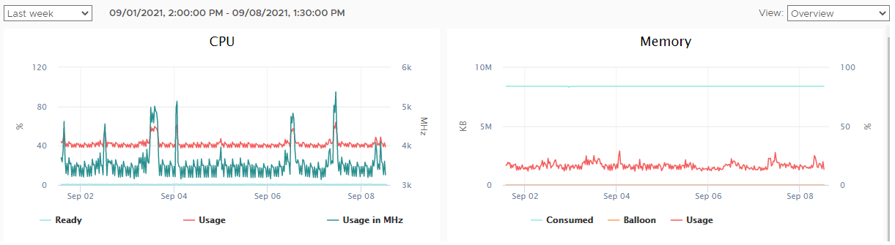

# Hardware recommendations for Arrigo Local

ver 1.2 - 23 Sep, 2021

author: Daniel Strand, Product Owner Arrigo

## Introduction

This is a guide to assist you in selecting the right hardware when considering Arrigo Local. There is no one definitive answer to what to select, but this document is an attempt to give you guidance to select the appropriate level of hardware for your requirements. 

## Summary

As a summary let's consider 3 levels of applications. Here is an indication of suitable hardware:

### Small Application

| Application details |              |
| ------------------- | ------------ |
| I/O                 | 500          |
| Devices             | 20           |
| Simultaneous users  | <5           |
| Logged analog       | 100          |
| Logged digitals     | 200          |
| Logged resolution   | every minute |
| Storage             | 5 years      |
|                     |              |

| Hardware/OS recommendations |                            |
| --------------------------- | -------------------------- |
| OS                          | Windows Server, see [System Requirements](./systemrequirements.md) |
| Processor                   | i5, 2-4 Cores              |
| Harddrive                   | 200 Gb, preferably SSD     |
| RAM                         | 8 Gb                       |
|                             |                            |

### Medium Application

| Application details |              |
| ------------------- | ------------ |
| I/O                 | 5,000        |
| Devices             | 200          |
| Simultaneous users  | <25          |
| Logged analog       | 1,000        |
| Logged digitals     | 2,000        |
| Logged resolution   | every minute |
| Storage             | 10 years     |
|                     |              |

| Hardware/OS recommendations |                            |
| --------------------------- | -------------------------- |
| OS                          | Windows Server, see [System Requirements](./systemrequirements.md) |
| Processor                   | i5, 4-8 Cores              |
| Harddrive                   | 2Tb Gb, preferably SSD     |
| RAM                         | 16 Gb                      |
|                             |                            |

### Large Application

| Application details |              |
| ------------------- | ------------ |
| I/O                 | 25,000       |
| Devices             | 1,000+       |
| Simultaneous users  | 50+          |
| Logged analog       | 5,000        |
| Logged digitals     | 10,000       |
| Logged resolution   | every minute |
| Storage             | 20 years     |
|                     |              |

| Hardware/OS recommendations |                            |
| --------------------------- | -------------------------- |
| OS                          | Windows Server, see [System Requirements](./systemrequirements.md) |
| Processor                   | i7, 8-32 Cores             |
| Harddrive                   | 5Tb Gb, preferably SSD     |
| RAM                         | 32 Gb                      |
|                             |                            |

### Real life example

| Application details |                             |
| ------------------- | --------------------------- |
| I/O                 | 15,000                      |
| External SQL Server | SQL Server Standard Edition |
|                     |                             |

| Hardware/OS - Arrigo Local |                                                   |
| -------------------------- | ------------------------------------------------- |
| OS                         | Windows Server 2019 64-bit                        |
| Processor                  | 4 core (Intel(R) Xeon(R) Gold 6230 CPU @ 2.10GHz) |
| Harddrive 1                | Operating system - 60GB                           |
| Harddrive 2                | Data - 40GB                                       |
| Harddrive 3                | SQL Server - 75GB                                 |
| RAM                        | 8Gb                                               |
| Hardware/OS -SQL Server    | unknown                                           |
|                            |                                                   |

Above graphs show CPU load and memory usage of the Arrigo Local computer.

## Discussion

There are many aspects of hardware and operating system that affect an Arrigo application. The basic rule is that more memory, higher frequency on memory and processor, larger cache, more cores, more threads will give higher performance and capability. How much more is dependent on the implementation and the use of resources on the computer. For example, a small Arrigo application with many simultaneous users may require an increase of RAM than in the recommendation above.

### Cores

How many CPU cores do I need?

Different computing tasks take different resources. The number one factor of whether programs will run smoothly is how many cores you have. If you want to run multiple apps at once or more resource-intensive programs, your device needs multiple CPU cores. But if you plan to simply create text documents, browse the web, or complete other basic tasks, then your basic models should include two cores, which you can find in most standard-tier laptops and computers.

**1 or 2 cores**

In this day and age it’s tough to find a computer with one core. If you do have just one, don’t expect to be able to do any serious multi-tasking. Dual-core is the sweet spot for most budget users and clients to Arrigo systems. You can access email, create and edit documents and spreadsheets, and have background tasks running without overloading your system. For Arrigo Local installations 2 cores should only be used for the absolute smallest and least work intensive applications.

**4 cores**

Quad-core CPUs allow you to render graphics in a quite effective way in addition to all your regular work on the server. This is a suitable entry point for an Arrigo application but still has power to spare for some expansion. These servers should also be equipped with at least with 8-16GB of RAM for optimum performance.

**6 or more cores**

For more advanced Arrigo applications, this is a good choice since it allows you to run multiple applications at once. Higher number of cores together with extra RAM (32GB) is optimal if you routinely use power-intensive software in addition to Arrigo.

### RAM

The amount of RAM that you use in your PC is an important element in how well it will perform. All the information that your OS and applications need to use while actively processing needs to be available in RAM. While the information that the system isn’t actively using can be written to storage in “swap files” when there’s too much to store in RAM, the process of constantly switching information to and from storage is slower than working with it directly in RAM.

So with all of that said: how much RAM do you need? That is, how much RAM is necessary to keep your PC running smoothly and to minimize the use of swap files? There’s a balance between equipping more RAM than you need and not having enough RAM for efficient operation.

| RAM           |                                                              |
| ------------- | ------------------------------------------------------------ |
| 8GB           | 8GB of RAM is the sweet spot for smaller applications, providing enough RAM for virtually all productivity tasks |
| 16GB to 32GB+ | If you’re running demanding Arrigo applications with additional software's, then we recommend that you start at 32GB and go up from there |
|               |                                                              |

### Operating System

Arrigo is only supported on 64-bit Windows platforms. Please refer to [System Requirements](./systemrequirements.md) for the latest list of supported operating systems. For any installation we recommend using Windows Server platforms. Windows versions such as Windows 11 Pro may be used for engineering, configuration and commissioning but is not recommended for running installations.

### SQL server

Depending on storage and performance requirements you may use SQL express or SQL server (Standard or Enterprise). Please note that harddrive requirements is dependent on where the SQL server is installed. Normally it is more efficient to run a separate SQL server for medium to large projects with dedicated hardware to maximize performance and to manage backup and other IT related architectural issues more efficiently.

SQL express is suitable for small scale applications and development but has certain limitations compared to SQL server. Below is a comparison of some features of SQL. Most noticeable is the maximum database size.

| Feature                                         | Express                      | Standard                       | Enterprise |
| ----------------------------------------------- | ---------------------------- | ------------------------------ | ---------- |
| Max. Compute Capacity (per  instance)           | Lesser of 1 socket / 4 cores | Lesser of 4 sockets / 24 cores | OS Max.    |
| Max. Buffer Pool Memory (per  instance)         | 1410MB                       | 128GB                          | OS Max.    |
| Max. Columnstore Cache  Memory (per instance)   | 352MB                        | 32GB                           | Unlimited  |
| Max. Memory-Optimized Data  Size (per instance) | 352MB                        | 32GB                           | Unlimited  |
| Max. database size                              | 10GB                         | 524PB                          | 524PB      |
| Cost                                            | free                         | $                              | $$         |
