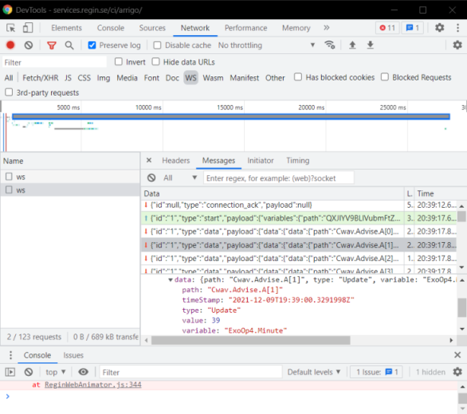

# WebSockets

## Background

ArrigoLocal depends heavily on [WebSockets](https://datatracker.ietf.org/doc/html/rfc6455) for both getting updated values from controllers and when using ServerSideFunctions. WebSockets is an open standard that has been supported by web browsers since 2011. The WebSocket protocol is designed to work over HTTP ports 443 and 80 as well as to support HTTP proxies and intermediaries, making it compatible with HTTP. 

## WebSockets in ArrigoLocal

The ArrigoLocal API has *two* specific endpoints for creating new WebSocket connections:

* `/arrigo/api/graphql/ws` (value updates from controllers etc.)
* `/arrigo/api/wamp` (ServerSideFunction calls)

## How to check for errors

Besides the most obvious, checking that the view looks like expected, you can also use the browser DevTools. Go to the Network tab and filter on WebSockets (WS). You should be able to see both the WebSocket upgrade process (handshake) and also inspect the actual messages sent between the browser and the API:


## Common errors

These are the two most common errors we get contacted about regarding WebSockets. The common symptom for these errors is that bound variables (in views) aren't shown but instead you see the "yellow box" pending state when the web runtime is waiting for the initial value updates. A description of these symptoms that we also hear a lot is: "It works on localhost or the intranet, but not when accessed from the outside (internet)".

Start by checking/verifying the following paragraphs and see if that solves the problem. Otherwise, feel free to contact us at arrigosupport@rssoftware.se.

### Self-signed certificates

*The use of self-signed certificates (SSC) in order to create SSL/TLS connections is strongly discouraged by Team Arrigo.*

Browsers are very strict and do not accept SSC's unless the user grants explicit permission. And even then, some functionality can fail silently (such as the creation of WebSockets).

Try switching over to using "regular" http (i.e. not https) to access the site from the outside. If everything works the SSC is to blame.

Buy a certificate from a known provider/Certificate Authority if you need SSL/TLS.

### Firewalls and reverse proxies

Some firewalls and reverse proxies do not allow WebSockets or need some configuration for this to work.

#### Firewalls

Since all vendors have their specific ways of enabling WebSockets we recommend that you simply search the interwebs for your model. Example:
`barracuda firewall enable websockets`

Or perhaps your IT department can help you with the configuration?

#### Reverse proxies

For reverse proxies you sometimes need to configure it to pass the WebSocket connection upgrade ("101 Switching Protocols"). Search for your vendor and follow the examples/guides. Example:
`nginx websockets proxy`

Note that some proxies require you to configure both the `/arrigo/api/graphql/ws` and `/arrigo/api/wamp` endpoints.

##### nginx example

Since we (RS Software) use nginx internally we can share our reverse proxy config:

```
location /arrigo/api/graphql/ws {
  proxy_set_header X-Forwarded-For $proxy_add_x_forwarded_for;
  proxy_http_version 1.1;
  proxy_set_header Upgrade "websocket";
  proxy_set_header Connection "Upgrade";
  proxy_pass http://192.168.0.1:80;
}

location /arrigo/api/wamp {
  proxy_set_header X-Forwarded-For $proxy_add_x_forwarded_for;
  proxy_http_version 1.1;
  proxy_set_header Upgrade "websocket";
  proxy_set_header Connection "Upgrade";
  proxy_pass http://192.168.0.1:80;
}
```

