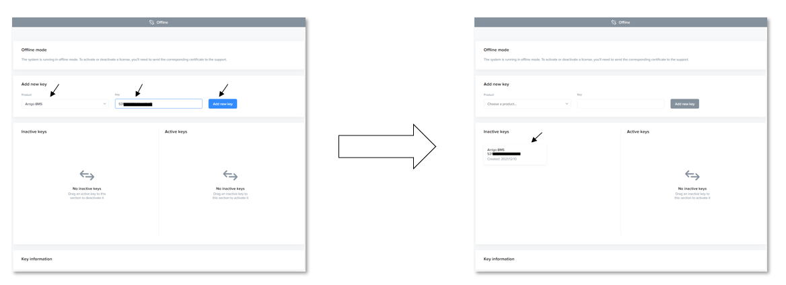
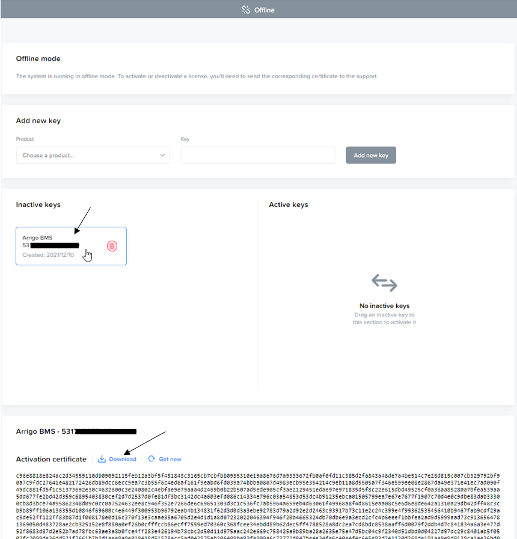
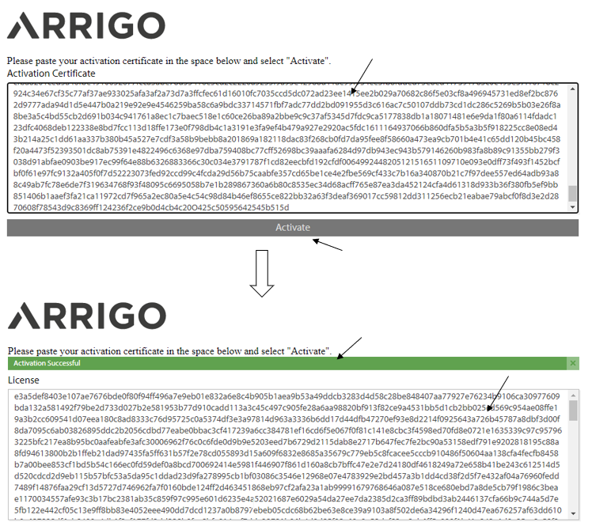
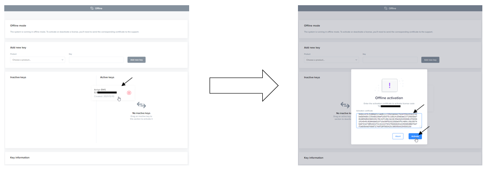
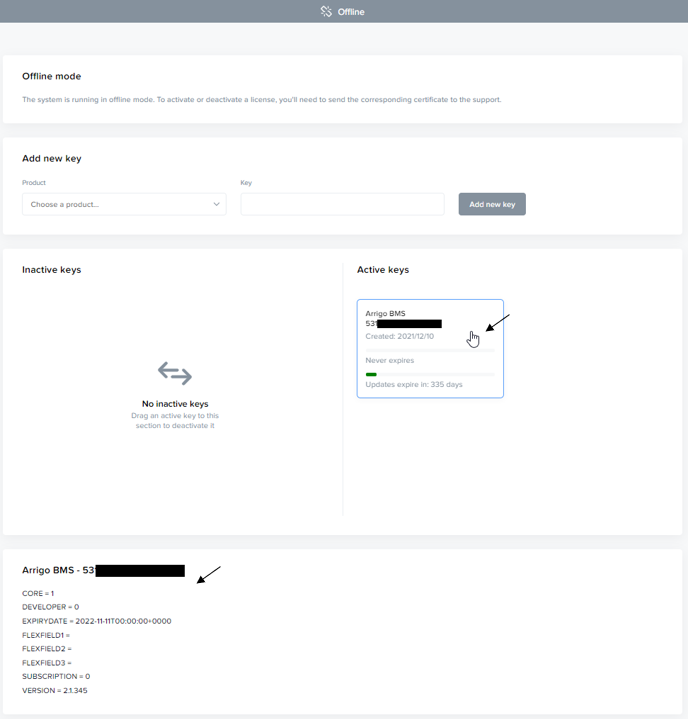

# Offline licensing

As part of Arrigo's licensing system (expected to be available q2, 2022) it is possible for Dark Sites (on-premise installations without internet connection) to activate and deactivate their licenses manually.

The outline below explains the procedure to activate and deactivate your licenses.

## Activate license

### Add the license code

Start your license manager on your Arrigo Local computer, select your product and enter your license code then select "Add new key". This should now give you a key in your "Inactive keys".

### Retrieve the activation certificate

Select the appropriate key in the Inactive keys list. The activation certificate will be displayed in the "Key information" section.

Select "Download" and save the activation certificate on a removable media.

### Generate the license certificate

Go to https://www.activationportal.me/selfservice/activation.aspx?Type=1&cid=7544&pid=9211&lang=en-US  and enter the computers activation certificate in the space provided, then select "Activate". Upon successful generation, a license certificate is generated and can be selected and saved on your removable media.

### Install the license certificate

In the License Manager, select and drag the appropriate license key to the "Active keys" list. A prompt will appear where you can enter your license certificate, then select "Activate".

Once activated successfully, the license should appear in the "Active keys" list. You can verify the license information by selecting it.

## Deactivate license

### Retrieve deactivation certificate

### Deactivate license