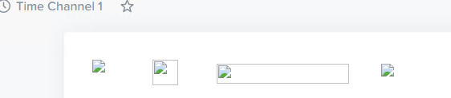
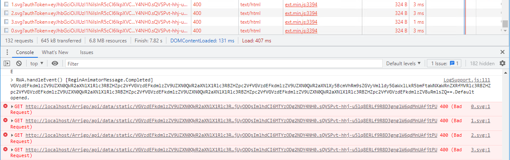
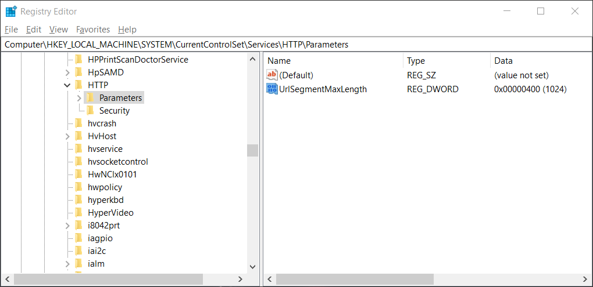
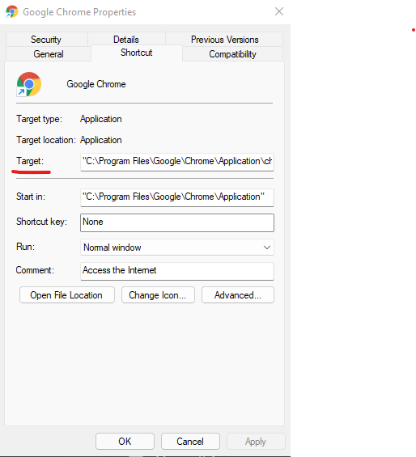

# Common questions and answers
[Broken image links](https://releases.arrigo.se/support/index.html#broken-image-links)

[Scheduled Windows task to run in background](https://releases.arrigo.se/support/index.html#my-scheduled-task-runs-in-foreground-blue-box)

[Controllers Web swipe does not work on panel PC](https://releases.arrigo.se/support/index.html#Controllers-Web-swipe-does-not-work-on-panel-PC)

## Broken image links

### Question

I'm getting broken image links in my views with the error `400 Bad Request`.

Why, and how do I fix it?

### Answer

This is an error in the IIS web server. The default limitation of "url parts" (segments) to 260 characters, so if you have long(er) nested area names this error can occur. This setting can be modified in the Windows Registry using the Registry Editor.

> This solution contains steps that tell you how to modify the registry. However, serious problems might occur if you modify the registry incorrectly. Therefore, make sure that you follow these steps carefully. For added protection, back up the registry before you modify it. Then, you can restore the registry if a problem occurs. For more information about how to back up and restore the registry, see [How to back up and restore the registry in Windows](https://support.microsoft.com/help/322756)

Start the Registry Editor with administrative privileges.

Navigate to `HKEY_LOCAL_MACHINE\SYSTEM\CurrentControlSet\Services\HTTP\Parameters`.

Create a new `REG_DWORD` in called `UrlSegmentMaxLength`.

Set its value to 400 hex or 1024 decimal.

Restart the computer for the changes to take effect.

## My scheduled task runs in foreground (blue box)

### Question 

When I setup a scheduled task in windows, the task runs in the foreground. I can't seem to configure the task to run hidden and not disturb the user.

### Answer

Excellent article that explains how to configure your scheduled task.
See [How do I set a Windows scheduled task to run in the background?](https://stackoverflow.com/questions/6568736/how-do-i-set-a-windows-scheduled-task-to-run-in-the-background)

## Controllers Web swipe does not work on panel PC

### Question
Controller Web touch scroll does not work on DP156NX panel pc. However if a mouse is installed it all works fine.

### Answer
To enable touch events add --touch-events as an argument in Target of the shortcut to your Chrome browser.
 
Chrome shortcut > Properties > 
Target: "C:\Program Files\Google\Chrome\Application\chrome.exe" --touch-events

