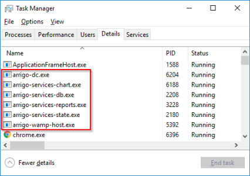
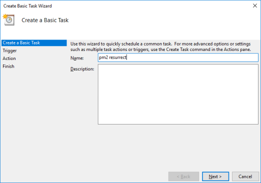
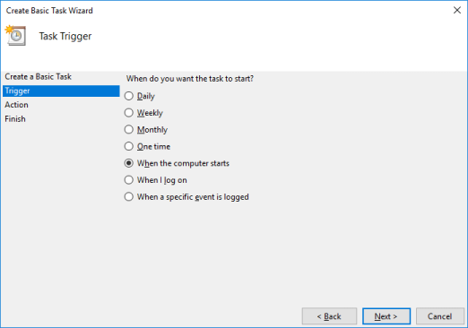
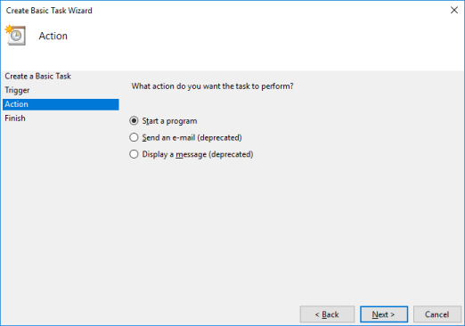
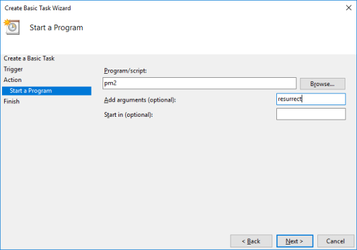
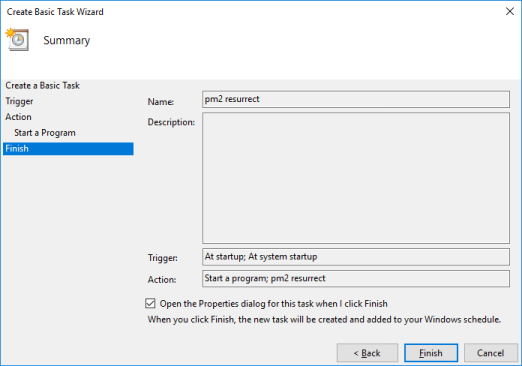
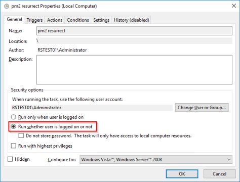
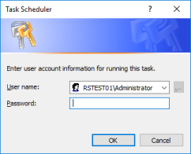

# Common questions and answers
[Broken image links](#broken-image-links)

[Scheduled Windows task to run in background](#my-scheduled-task-runs-in-foreground-blue-box)

[Controllers Web swipe does not work on panel PC](#question-2)

[Arrigo button in view maneuver open document does not work](#arrigo-button-in-view-maneuver-open-document-does-not-work)

[Use Arrigo's process management for my own services](#use-arrigos-process-management-for-my-own-services)

[Arrigo Services are not starting up after reboot](#arrigo-services-are-not-starting-up-after-reboot)

## Broken image links

### Question

I'm getting broken image links in my views with the error `400 Bad Request`.

Why, and how do I fix it?

### Answer

This is an error in the IIS web server. The default limitation of "url parts" (segments) to 260 characters, so if you have long(er) nested area names this error can occur. This setting can be modified in the Windows Registry using the Registry Editor.

> This solution contains steps that tell you how to modify the registry. However, serious problems might occur if you modify the registry incorrectly. Therefore, make sure that you follow these steps carefully. For added protection, back up the registry before you modify it. Then, you can restore the registry if a problem occurs. For more information about how to back up and restore the registry, see [How to back up and restore the registry in Windows](https://support.microsoft.com/help/322756)

Start the Registry Editor with administrative privileges.

Navigate to `HKEY_LOCAL_MACHINE\SYSTEM\CurrentControlSet\Services\HTTP\Parameters`.

Create a new `REG_DWORD` in called `UrlSegmentMaxLength`.

Set its value to 400 hex or 1024 decimal.

Restart the computer for the changes to take effect.

## My scheduled task runs in foreground (blue box)

### Question 

When I setup a scheduled task in windows, the task runs in the foreground. I can't seem to configure the task to run hidden and not disturb the user.

### Answer

Excellent article that explains how to configure your scheduled task.
See [How do I set a Windows scheduled task to run in the background?](https://stackoverflow.com/questions/6568736/how-do-i-set-a-windows-scheduled-task-to-run-in-the-background)

## Controllers Web swipe does not work on panel PC

### Question
Controller Web touch scroll does not work on DP156NX panel pc. However if a mouse is installed it all works fine.

### Answer
To enable touch events add --touch-events as an argument in Target of the shortcut to your Chrome browser.

Chrome shortcut > Properties > 
Target: "C:\Program Files\Google\Chrome\Application\chrome.exe" --touch-events

## Arrigo button in view maneuver open document does not work

### Question
Open document work with link icons, why doesn't it work in view buttons?

### Answer
We recommend instead to use the OpenLink option in the button and redirect to the configured linkIcon with the document.
During 2022/2023 we will build Arrigo Studio with the new viewdesigner, therefore we do not want to alter too much in the existing view designer as it is legacy code.

## Use Arrigo's process management for my own services

### Question
If I have my own Node.JS application, can I piggy-back on Arrigo's services to manage startup and shutdown

### Answer
Arrigo uses a process manager called PM2 for its process management. At a glance it is an advanced process manager for production Node.js applications with load balancer, logs facility, startup script and micro service management.

PM2 uses a file called ecosystem.config.js and it is located in your project folder (eg. C:\EXO Projects\Regin\Arrigo\pm2). All documentation about the file is located here: 
[https://pm2.keymetrics.io/docs/usage/quick-start/](https://pm2.keymetrics.io/docs/usage/quick-start/)

In short, add an entry (the command line command) to that file with the information of the Node.JS application you wish to run with Arrigo. 
Attach the project again and the Node.JS application should be started. 

## Arrigo Services are not starting up after reboot

### Question

After a reboot of the server  views with SSF code (ServerSide Functions) and reports aren't displaying correctly.  
For example, if I click a report nothing is shown except the loader.

### Answer

Verify (on the server) whether the Arrigo Services are running or not:

* Open the Task Manager
* Check for processes starting with "arrigo-". An example of a working server:
  

If they _are_ running you should instead look at [this document](https://releases.arrigo.se/help/websockets.html) which talks about websockets.

#### Solution 1

* Open a command prompt or PowerShell prompt in **admin mode**
* Run the command `npm install pm2-windows-startup -g`
* Run the command `pm2-startup install`

If the commands ran without errors you can reboot the machine and verify that the Arrigo Services are running.

If the services still aren't running you can try [solution 2](#solution-2).

**Note!**  
The commands will fail if your server isn't connected to the internet. In that case you can contact arrigosupport@rssoftware.se for further instructions.

#### Solution 2

* Open the Task Scheduler in Windows
* Create a new Basic Task with the name "pm2 resurrect"
  
* Configure it to run when the computer starts
  
* Select "Start a program" as the Action
  
* Enter `pm2` as the Program/script and `resurrect` as an argument
  
* Tick the "Open the Properties dialog..." checkbox and click "Finish"
  
* Select the option "Run whether the user is logged on or not"
  
* When you click "OK" you will be prompted for the password of the currently logged on user. Enter it and click "OK"
  

Reboot the machine and verify that the Arrigo Services are running.

If the services still aren't running you can can contact arrigosupport@rssoftware.se for further troubleshooting.
